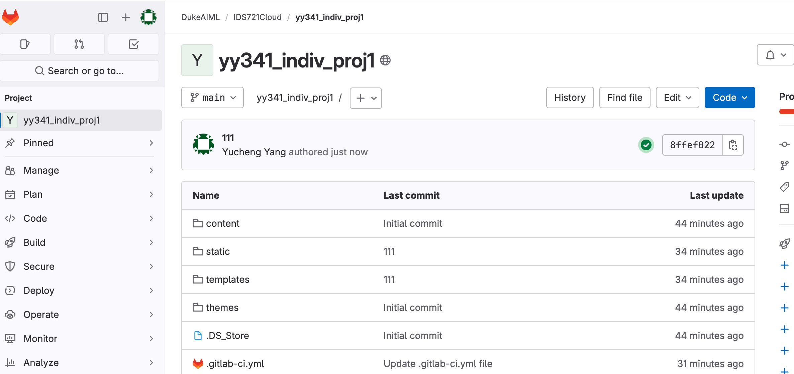
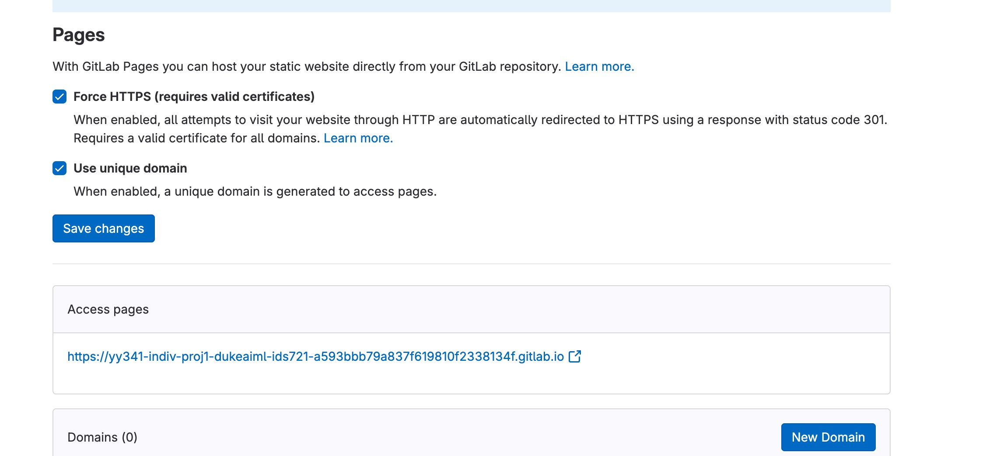
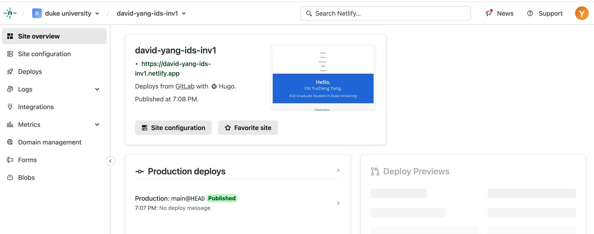
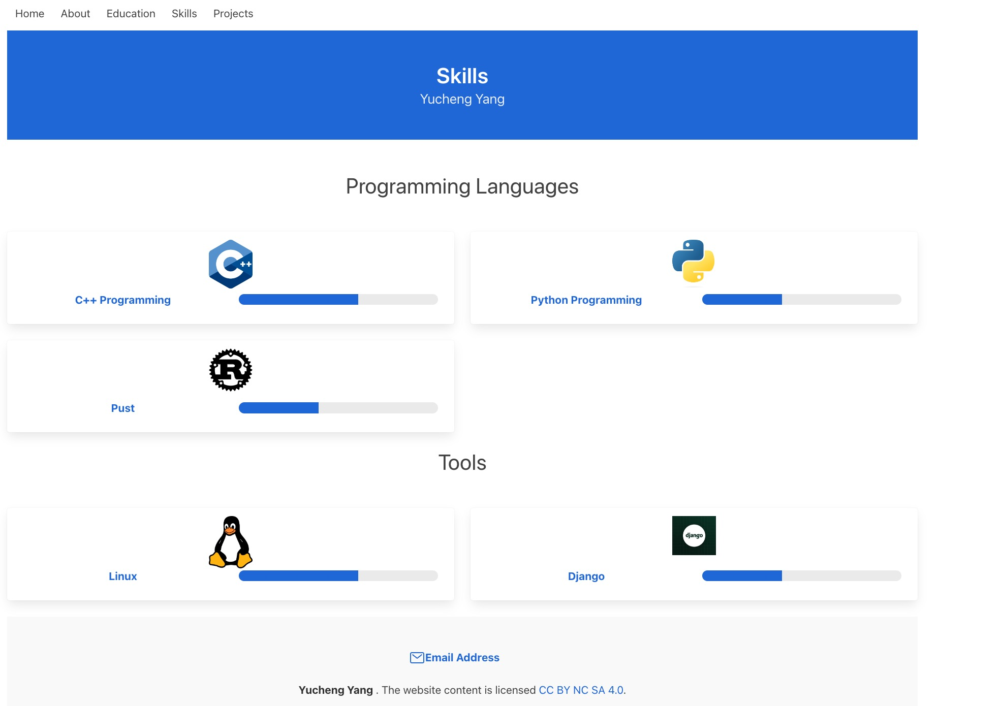
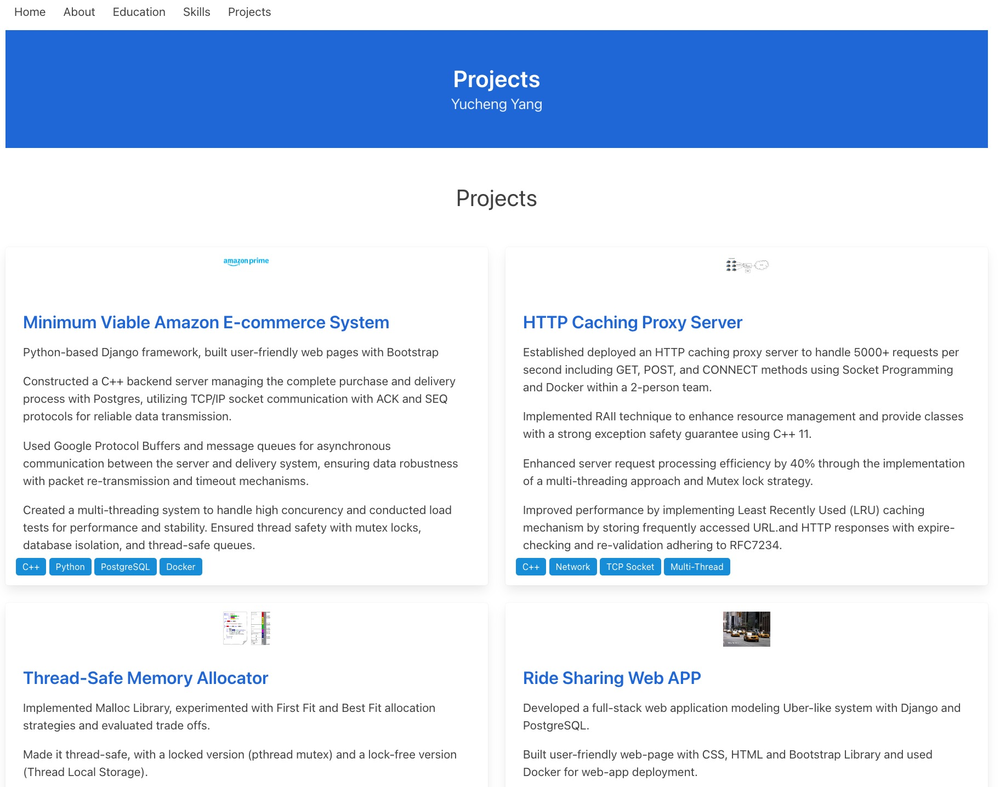
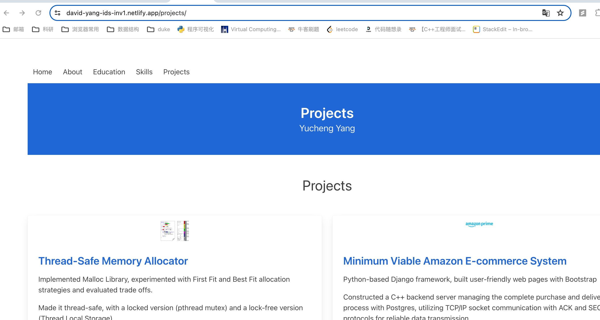

# IDS 721 Individual Project 1

  

> Yucheng Yang (David)

> NetID: yy341

web links:

gitlab:

https://yy341-indiv-proj1-dukeaiml-ids721-a593bbb79a837f619810f2338134f.gitlab.io/

netlify:

https://david-yang-ids-inv1.netlify.app/
  
demo video:

at static/demo.mov

https://gitlab.com/dukeaiml/IDS721/yy341_indiv_proj1/-/blob/main/static/demo.mov?ref_type=heads

## Project Introduction


**Continuous Delivery of Personal Website**

Requirements:

-   Website built with [ZolaLinks to an external site.](https://www.getzola.org/), Hugo, Gatsby, Next.js or equivalent
-   GitLab workflow to build and deploy site on push
-   Hosted on Vercel, Netlify, AWS Amplify, AWS S3, or others.

## Project Steps

### Installation Steps

It is very easy to get started with Zola. Here are some basic steps:

```
brew install zola
zola init indv1
```

I used the [ hephaestus](https://www.getzola.org/themes/hephaestus/) theme as shown on the Zola official website. Here are the key steps:

First, you will download the theme into your  `themes`  directory:

```bash
$ cd themes
$ git clone https://github.com/BConquest/hephaestus
```

Second, you will enable the theme in your  `config.toml`  directory:

```toml
theme = "hephaestus"
```
### Deploy Steps
To integrate a theme into your GitLab repository and ensure accessibility for the runner, use the following command to add the theme as a submodule:

bashCopy code

`git submodule add <HTTP_THEME_URL> themes/<THEME_NAME>` 

This command links the theme located at `<HTTP_THEME_URL>` to the specified directory `themes/<THEME_NAME>` within your project.

For setting up the GitLab CI/CD pipeline, create a file named `.gitlab-ci.yml` in the root directory of your repository. In this YAML file, define the deployment commands to facilitate the pipeline process. Your `.gitlab-ci.yml` should include the necessary instructions for building and deploying the site.

```
stages:

- deploy

  

default:

image: debian:stable-slim

tags:

- docker

  

variables:

# The runner will be able to pull your Zola theme when the strategy is

# set to "recursive".

GIT_SUBMODULE_STRATEGY: "recursive"

  

# If you don't set a version here, your site will be built with the latest

# version of Zola available in GitHub releases.

# Use the semver (x.y.z) format to specify a version. For example: "0.17.2" or "0.18.0".

ZOLA_VERSION:

description: "The version of Zola used to build the site."

value: ""

  

pages:

stage: deploy

script:

- |

apt-get update --assume-yes && apt-get install --assume-yes --no-install-recommends wget ca-certificates

if [ $ZOLA_VERSION ]; then

zola_url="https://github.com/getzola/zola/releases/download/v$ZOLA_VERSION/zola-v$ZOLA_VERSION-x86_64-unknown-linux-gnu.tar.gz"

if ! wget --quiet --spider $zola_url; then

echo "A Zola release with the specified version could not be found.";

exit 1;

fi

else

github_api_url="https://api.github.com/repos/getzola/zola/releases/latest"

zola_url=$(

wget --output-document - $github_api_url |

grep "browser_download_url.*linux-gnu.tar.gz" |

cut --delimiter : --fields 2,3 |

tr --delete "\" "

)

fi

wget $zola_url

tar -xzf *.tar.gz

./zola build

  

artifacts:

paths:

# This is the directory whose contents will be deployed to the GitLab Pages

# server.

# GitLab Pages expects a directory with this name by default.

- public

  

rules:

# This rule makes it so that your website is published and updated only when

# you push to the default branch of your repository (e.g. "master" or "main").

- if: $CI_COMMIT_BRANCH == $CI_DEFAULT_BRANCH
```

Please note that this script is designed with the assumption that the GitLab Runner is configured to use the Docker executor. Once the project is pushed to the default branch of the repository, the GitLab CI/CD pipelines will take care of automatically publishing and updating your site. You can find the URL of the deployed website under Deploy > Pages. Feel free to modify the file according to your workflow and specific needs.



Here is the screenshot of GitLab CICD pipeline succeed.



The GitLab page settings can get the url of our website.

## Host on Netlify

To deploy your site on Netlify, follow these steps:

1. **Create a `netlify.toml` File:**
   - In the root directory of your project, create a file named `netlify.toml`.

2. **Add Deploy Commands in `netlify.toml`:**
   - Edit the `netlify.toml` file and add the following content:

```toml
[build]
# This assumes that the Zola site is in a docs folder. If it isn't, you don't need
# to have a `base` variable but you do need the `publish` and `command` variables.
publish = "/public"
command = "zola build"

[build.environment]
# Set the version name that you want to use and Netlify will automatically use it.
ZOLA_VERSION = "0.18.0"

[context.deploy-preview]
command = "zola build --base-url $DEPLOY_PRIME_URL"
```

Adjust the configuration according to your project structure and requirements.

3. **Push the Project to GitLab:**
   - Commit the changes made to the `netlify.toml` file and push the project to your GitLab repository.

4. **Sign in to Netlify:**
   - Go to the Netlify website and sign in to your account.

5. **Add a New Site in Netlify:**
   - In the Netlify dashboard, click on "New site from Git."
   - Select the GitLab option and authenticate Netlify to access your GitLab repositories.

6. **Import the Repository:**
   - Choose the repository you want to deploy from the list of GitLab repositories.
   - Netlify will automatically detect the `netlify.toml` configuration from your repository.

7. **Configure Build Settings:**
   - Netlify will prompt you to configure build settings. Ensure that the build command and publish directory match the values specified in your `netlify.toml` file.

8. **Deploy the Site:**
   - Complete the setup process and trigger the initial deployment.



Following these steps will enable Netlify to build and deploy your site using the configuration specified in the `netlify.toml` file. The deployment settings are automatically filled in based on the contents of the configuration file.

## Website Screenshots






The followings are the GitLab deployed web page and Netlify deployed website.





