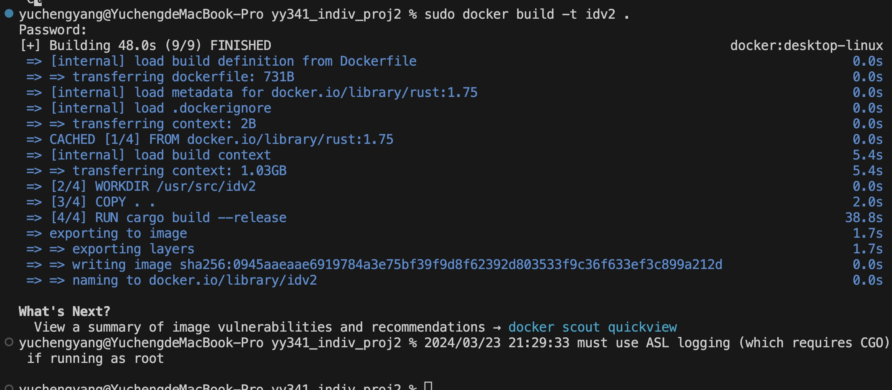
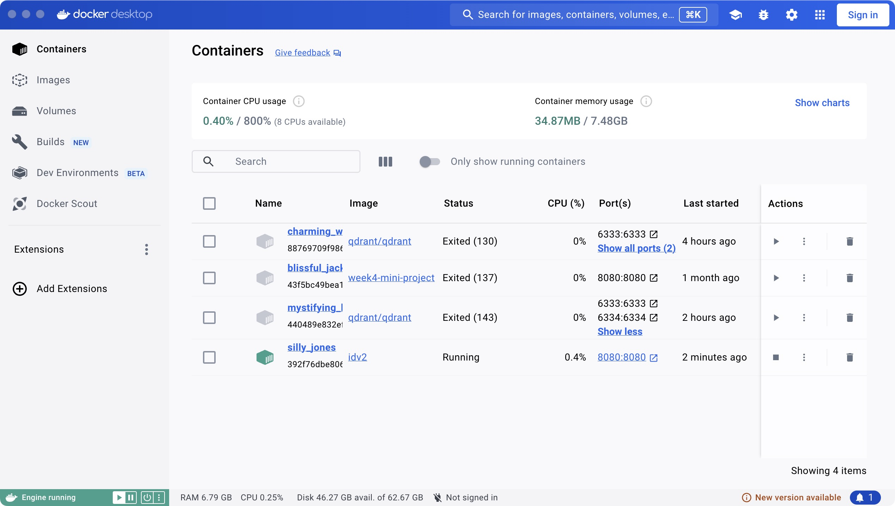
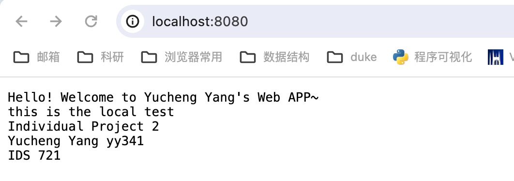
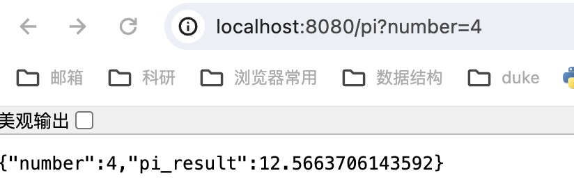

# IDS 721 Individual Project 2

  

> Yucheng Yang (David)

> NetID: yy341

demo video:

at images/demo.mov

https://gitlab.com/dukeaiml/IDS721/yy341_indiv_proj2/-/blob/main/images/demo_2.mov?ref_type=heads

  

## Project Introduction

This endeavor establishes a straightforward REST API/web service in Rust, encapsulated within Docker for smooth deployment. It encompasses CI/CD pipeline configurations to automate building, testing, and deploying procedures, guaranteeing the streamlined continuous delivery of the Rust microservice.

## Functionality

This microservice built in Rust employs the Actix web framework to furnish a straightforward REST API, featuring two distinct endpoints. The primary endpoint welcomes users and furnishes guidance on utilizing the service, whereas the '/pi' endpoint calculates the value of pi times the input number provided. Users can access these functionalities by specifying the number as a query parameter in the URL. The service adeptly manages requests by parsing the number parameter, computing the triple power, and furnishing a JSON response containing both the original number and its pi multiple. Fueled by Actix web and engineered for effortless deployment via Docker, this microservice assures dependable and scalable performance in computing the triple power of numbers through an intuitive API interface.
## Project Steps

### Docker Setups:

Below is the Dockerfile that sets up a builder stage for building a Rust application using the official Rust 1.75 image as the base image. It specifies the working directory inside the container where the project will be located, copies the entire content of the local directory into the container's working directory, runs `cargo build --release` to build the project with optimized code, exposes port 8080 for outside access typically used by Actix-Web, a popular Rust web framework, and defines the default command to run when the container starts using `cargo run`. This Dockerfile facilitates efficient containerization and deployment of Rust applications, offering a streamlined workflow for building and running Rust projects in a containerized environment.

```Dockerfile
# Use official Rust 1.75 image as base image
FROM rust:1.75 AS builder

# Set the working directory inside the container
WORKDIR /usr/src/idv2

# Copy the entire content of the local directory into the container's working directory
COPY . .

# Build the project with optimized code
RUN cargo build --release

# Expose port 8080 for outside access
EXPOSE 8080

# Define the default command to run when the container starts
CMD ["cargo", "run"]
```
To build the Docker image using the provided Dockerfile and then run the container locally, follow these steps:

1. **Build Docker Image**:
```bash
sudo docker build -t idv2 .
```

2. **Run Docker Container**:
```bash
sudo docker run -p 8080:8080 idv2
```

After running these commands, the application should be accessible at http://localhost:8080/ in your web browser. 

### CI/CD Pipeline

The .gitlab-ci.yml file below outlines a GitLab CI/CD pipeline configuration. It sets up a pipeline with one stage called "build" and defines variables for use across jobs, including the Docker image tag, Docker host, and Docker driver. The build job employs Docker-in-Docker service for Docker image construction. Before executing the script, it authenticates with the GitLab Container Registry using provided credentials. During script execution, it constructs a Docker image labeled as rust-microservice, launches it as a detached container with port 8080 exposed, and displays container information using the command docker ps -a. Lastly, in the after-script section, it outputs a message confirming that the Rust microservice is operational on port 8080. This YAML file streamlines the Rust microservice's building and deployment process within a CI/CD pipeline, ensuring smooth integration and testing procedures.
```
# Define stages for the pipeline
stages:
  - build

# Define variables that can be used across jobs
variables:
  IMAGE_TAG: $CI_REGISTRY_IMAGE:$CI_COMMIT_REF_SLUG
  DOCKER_HOST: tcp://docker:2375
  DOCKER_DRIVER: overlay2

build:
  stage: build
  image: docker:stable  # Use the Docker image for running Docker commands
  services:
    - docker:dind  # Enable Docker-in-Docker service for building Docker images
  before_script:
    - docker login -u "$CI_REGISTRY_USER" -p "$CI_REGISTRY_PASSWORD" "$CI_REGISTRY"  # Log in to the GitLab Container Registry
  script:
    - docker build -t rust-microservice .
    - docker run -d -p 8080:8080 rust-microservice
    - docker ps -a
  after_script:
    - echo "Rust microservice is now running on port 8080"

```
## Screenshots
Build the docker:


View the containers in Docker:


Test the Rust web APP:





