# IDS 721 Individual Project 4 - Rust AWS Lambda and Step Functions

## Student Information

**Name:** Yucheng Yang (David)  
**NetID:** yy341

## Project Introduction

This project aims to develop a data processing pipeline utilizing Rust AWS Lambda functions coordinated by AWS Step Functions. The pipeline includes several tasks such as data preprocessing, designed to demonstrate the effective use of cloud-based function orchestration.

## Functionalities Overview

- **Remove Numbers from Text**
  - **Description:** This Lambda function removes all numbers from the input text. Useful for text analyses like sentiment analysis or topic classification where numbers may not carry relevant information. Outputs text devoid of numbers.

- **Remove Punctuation**
  - **Description:** Strips all punctuation marks from the input text, allowing analyses to focus solely on the textual content. Outputs text devoid of punctuation marks.

## Objectives

- Implement Rust AWS Lambda functions.
- Utilize AWS Step Functions to coordinate these Lambdas.
- Orchestrate a comprehensive data processing pipeline.

## Setup and Deployment

### Step 1: Function Setup

Generate and set up the Lambda functions using the following commands:

```bash
cargo lambda new rm_num
cargo lambda new rm_punc
```

After coding the specific functionalities in each `main.rs` and updating `Cargo.toml` for dependencies, deploy the Lambda functions to AWS with:
  

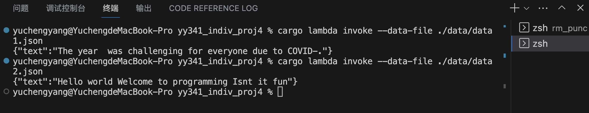


```bash
cargo lambda build --release
cargo lambda deploy --region us-east-2 --iam-role arn:aws:iam::730335239971:role/ids721
```
  

Here are results for testing:

  

  

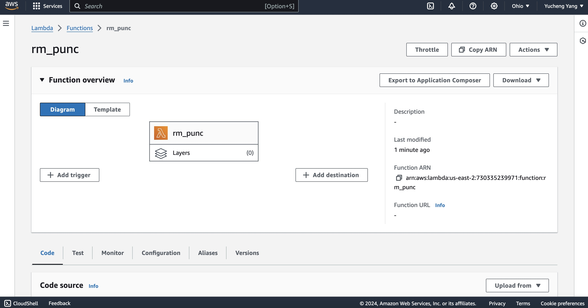

  

  

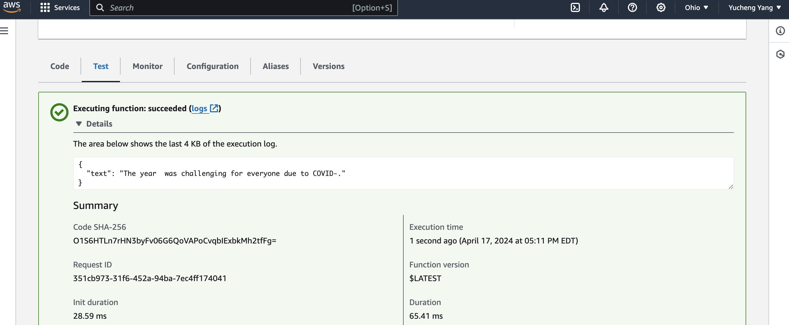

  

  

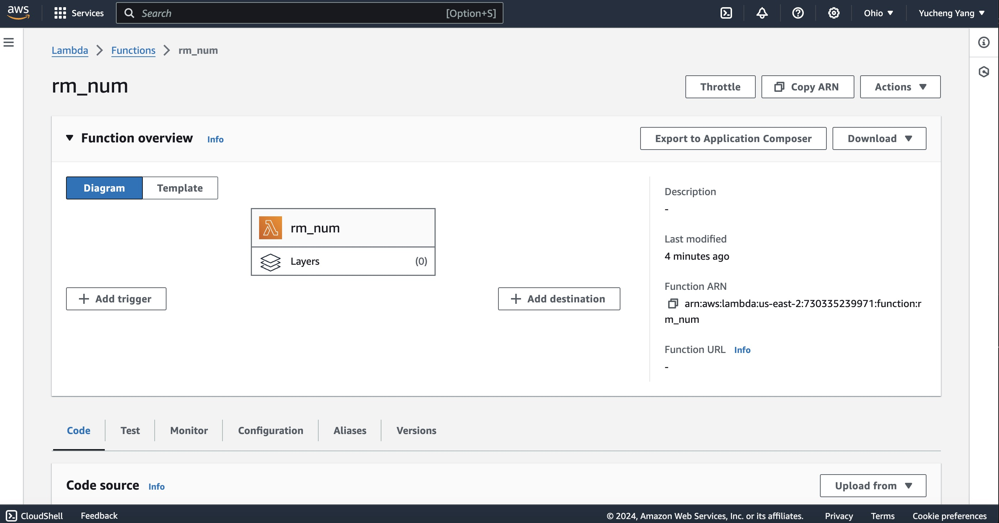

  

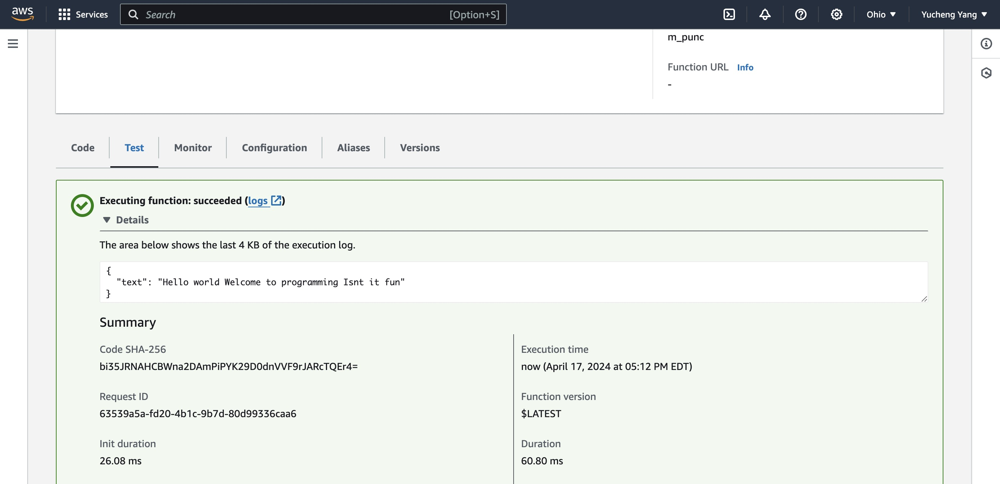

### Step 2: Step Functions Setup

Create and configure a new Step Function in the AWS console with the following JSON definition:

```json
{
  "Comment": "This state machine transforms input text by removing numbers and punctuation.",
  "StartAt": "RM_Number",
  "States": {
    "RM_Number": {
      "Type": "Task",
      "Resource": "arn:aws:lambda:us-east-2:730335239971:function:rm_num",
      "Next": "RM_Punctuation"
    },
    "RM_Punctuation": {
      "Type": "Task",
      "Resource": "arn:aws:lambda:us-east-2:730335239971:function:rm_punc",
      "End": true
    }
  }
}
```
  

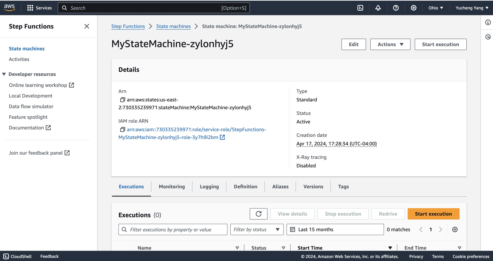


## Continuous Integration and Deployment with GitLab CI/CD

Deploy the project using the provided `.gitlab-ci.yml` configuration. Ensure to set up the required AWS credentials as environment variables in your GitLab project settings:

```yaml
stages:
  - rm_num_stage
  - rm_punc_stage

variables:
  AWS_DEFAULT_REGION: us-east-2
  AWS_ACCESS_KEY_ID: $AWS_ACCESS_KEY_ID
  AWS_SECRET_ACCESS_KEY: $AWS_SECRET_ACCESS_KEY

rm_num_stage:
  stage: rm_num_stage
  image: rust:latest
  script:
    - rustup default stable
    - apt-get update && apt-get install -y wget unzip xz-utils zip musl-tools
    - wget https://ziglang.org/download/0.9.1/zig-linux-x86_64-0.9.1.tar.xz
    - tar -xf zig-linux-x86_64-0.9.1.tar.xz -C /usr/local
    - export PATH=$PATH:/usr/local/zig-linux-x86_64-0.9.1
    - cargo install cargo-lambda
    - rustup target add x86_64-unknown-linux-musl
    - cd rm_num
    - cargo lambda build --release
    - cargo lambda deploy
  only:
    - main

rm_punc_stage:
  stage: rm_punc_stage
  image: rust:latest
  script:
    - rustup default stable
    - apt-get update && apt-get install -y wget unzip xz-utils zip musl-tools
    - wget https://ziglang.org/download/0.9.1/zig-linux-x86_64-0.9.1.tar.xz
    - tar -xf zig-linux-x86_64-0.9.1.tar.xz -C /usr/local
    - export PATH=$PATH:/usr/local/zig-linux-x86_64-0.9.1
    - cargo install cargo-lambda
    - rustup target add x86_64-unknown-linux-musl
    - cd rm_punc
    - cargo lambda build --release
    - cargo lambda deploy
  only:
    - main
```
  
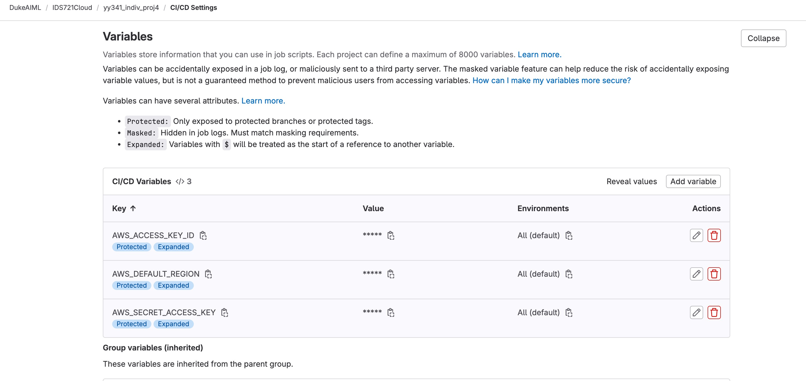

## Testing and Demonstrations

Visual results and testing outputs from the deployment process can be found below.
  

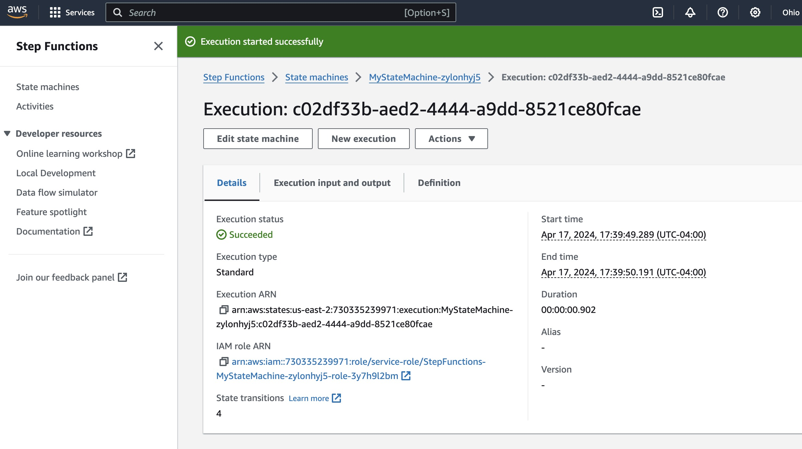

  

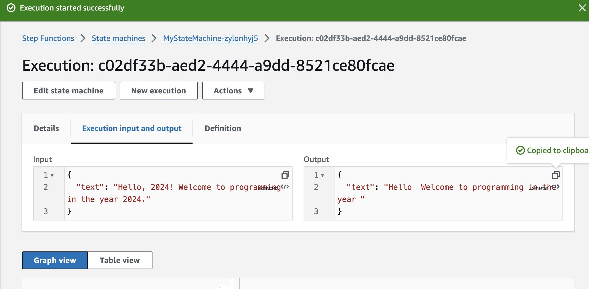

  

  

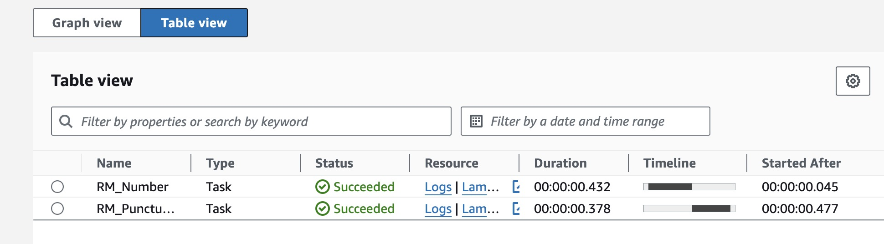

  

  

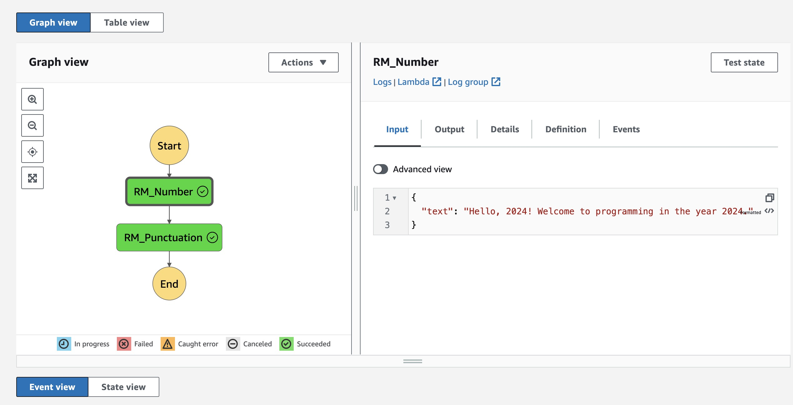

  

  

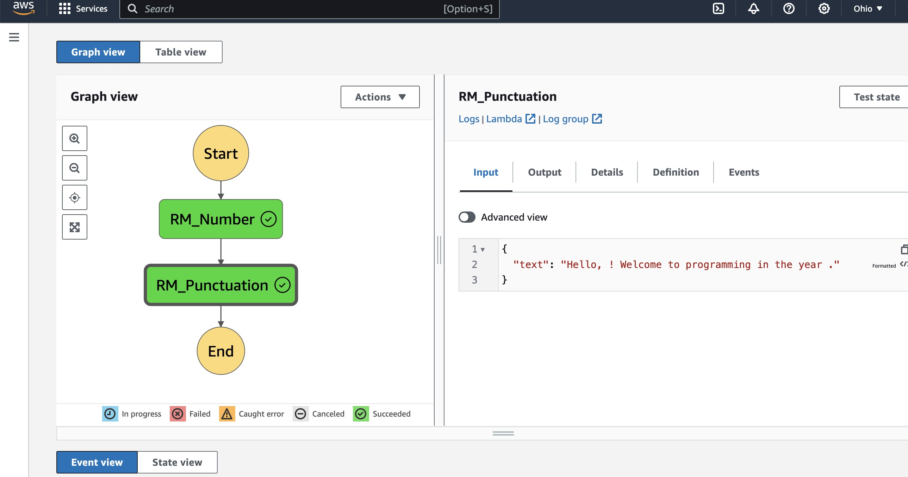

  


For additional demonstrations, you can view the demo video [here](./images/idv4_demo.mov).

