# IDS 721 Mini Project 10
# Rust Serverless Transformer Endpoint

  

> Yucheng Yang (David)

> NetID: yy341

  

## Project Introduction

This project focuses on creating and deploying a large language model (LLM) using Rust and Cargo Lambda in a serverless environment on AWS Lambda. It includes setting up a local LLM inference endpoint.

### Objectives:

-   Containerize a Hugging Face Rust transformer using Docker.
-   Deploy the Docker container to AWS Lambda.
-   Establish a query endpoint for the model.

## Project Setup

### Step 0: Choosing the LLM Model

Given that AWS Lambda functions are designed to terminate automatically after 15 minutes, deploying overly large models isn't feasible. Therefore, from the 11 LLM models available in the Hugging Face: rustformers - Large Language Models in Rust repository, the rustformers/bloom-ggml model has been selected. This model's smaller size makes it a practical choice for integration with AWS Lambda functions and aligns well with the goals of this project.

### Step 1: Project Setup

-   Begin by initializing a new AWS Lambda project in Rust using the `cargo lambda new <PROJECT_NAME>` command in the terminal. Here I used `cargo lambda new mini10` 
    
-   Update the `Cargo.toml` file to include all required dependencies.
    
-   Implement the functional code and set up the inference endpoint in the `main.rs` file.
    
-   Use `cargo lambda watch` for live updates, and test the setup locally with the command:
    
    bashCopy code
    
    `curl "http://localhost:9000?text=Students%20From%20Duke%20University"` 
    
    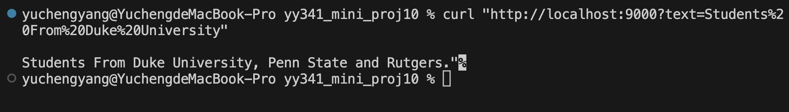

	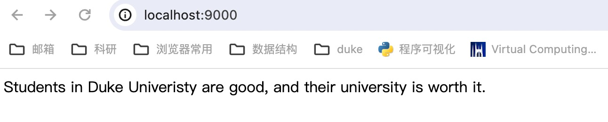

	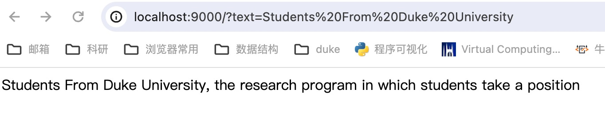

### Step 2: Dockerization and Using Elastic Container Registry (ECR)

-   Once the local endpoint is confirmed to be working, proceed to the AWS console's Identity and Access Management (IAM) section.
    
-   Create a new user and assign necessary policies, including:
    
    -   IAMFullAccess
    -   AWSLambda_FullAccess
    -   AWSAppRunnerServicePolicyForECRAccess
    -   EC2InstanceProfileForImageBuilderECRContainerBuilds
-   Next, go to ECR in the AWS console and set up a new private repository.
    
-   Connect your local Docker environment to AWS by executing:    
    cssCopy code
    
    `aws ecr get-login-password --region us-east-2 | docker login --username AWS --password-stdin <AWS-ACCOUNT-NUMBER>.dkr.ecr.us-east-2.amazonaws.com` 

	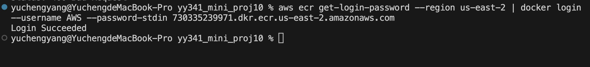
    
-   Build the Docker image with the command:
    
    cssCopy code
    
    `docker buildx build --progress=plain --platform linux/arm64 -t mini10 .` 
    
    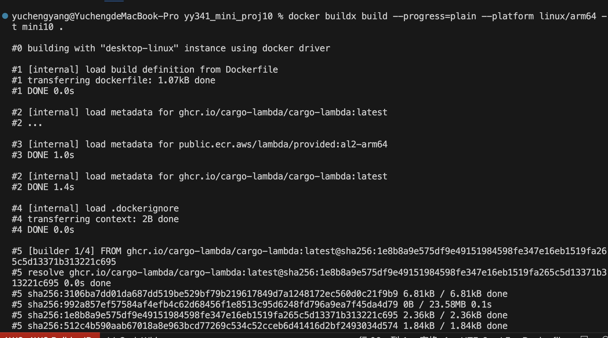

	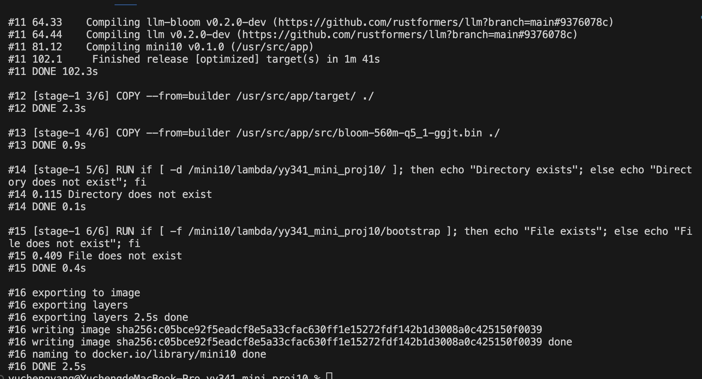
-   Tag the newly created Docker image:
    
    bashCopy code
    
    `docker tag transformer:latest 590183895316.dkr.ecr.us-east-1.amazonaws.com/mini10:latest` 
    
-   Finally, upload the tagged image to the ECR repository:
    
    bashCopy code
    
    `docker push 590183895316.dkr.ecr.us-east-1.amazonaws.com/mini10:latest` 
    
   	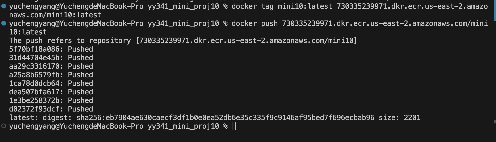

This revised sequence provides a clear and structured approach to deploying your LLM using Rust and AWS Lambda, following best practices for AWS infrastructure and Docker utilization.

## AWS Lambda Function Setup

After successfully uploading the Docker image to the Elastic Container Registry (ECR), proceed by opening the Lambda service in the AWS console.
   	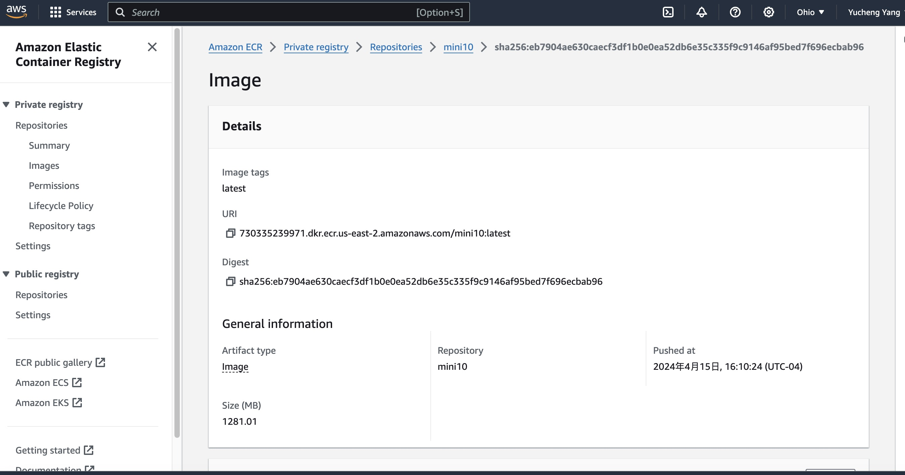
-   **Create a New Function:** Select the "Container image" option when creating a new function. Enter the Amazon ECR image URL and select the arm64 architecture for the function's configuration.
   	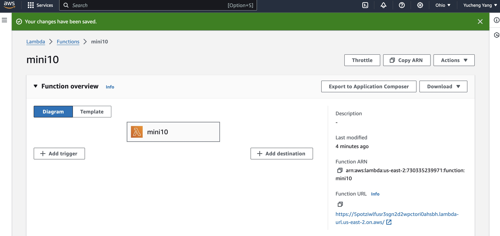
-   **Configure the Function:** Once the function is created, go to the configuration section of your Lambda function. Under "General configuration," adjust the Memory and Timeout settings to accommodate the demands of your LLM, such as token processing capabilities and expected execution time.
-   **Set Up Function URL:** Navigate to the function URL section and establish a new function URL. Ensure that CORS (Cross-Origin Resource Sharing) is enabled to allow web-based clients to interact with your Lambda function securely.

These steps will guide you through deploying a serverless application using a Docker image hosted in ECR, optimizing it for performance with specific settings, and making it accessible via a web-friendly URL with CORS support.

## CURL Request Against Endpoint

We can use the following command to test the endpoint:

`curl https://3yfuld5gnc2vmlh3r7ktaisgom0yvrgy.lambda-url.us-east-1.on.aws/\?text=Students%20in%20Duke%20University`

   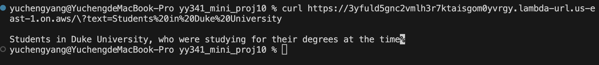
   	

   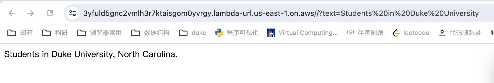
   	
    
   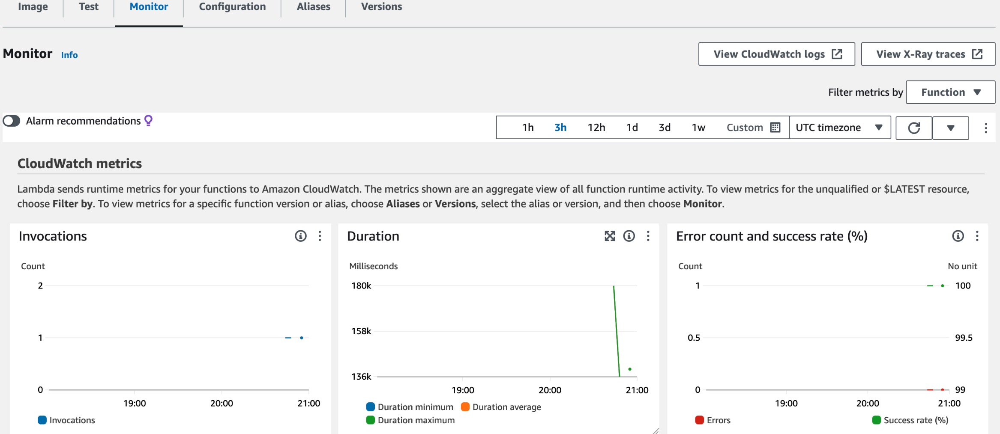
