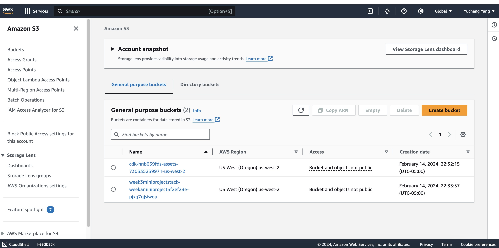
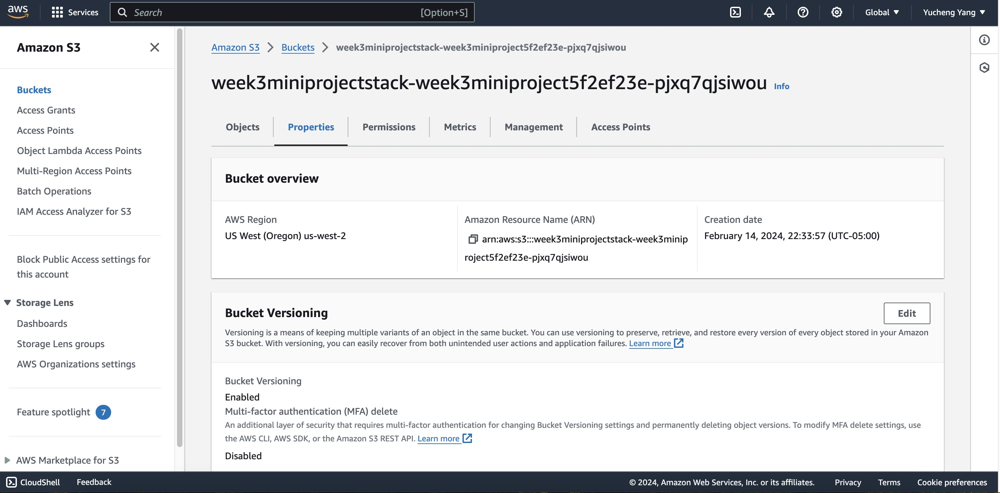
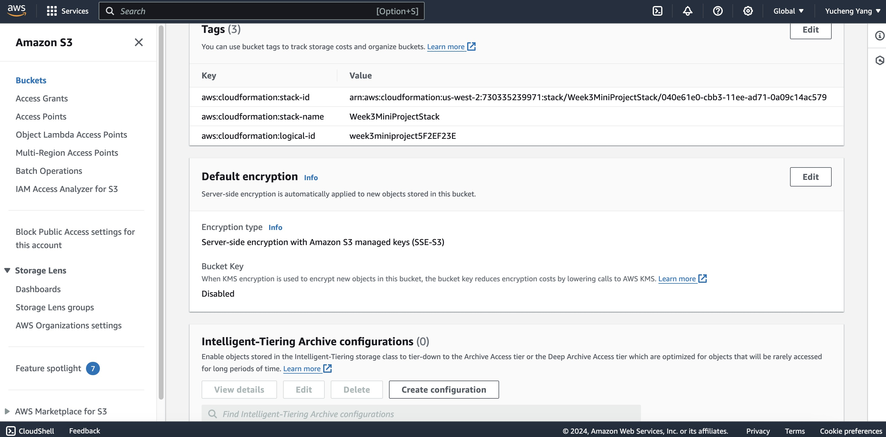

# IDS 721 Week 3 Mini Project

  

> Yucheng Yang (David)

> NetID: yy341

  

## Project Introduction

Create an S3 Bucket using CDK with AWS CodeWhisperer.

Requirements:

Create S3 bucket using AWS CDK

Use CodeWhisperer to generate CDK code

Add bucket properties like versioning and encryption

  

## Project Setup

1. Log in to [CodeCatalyst](https://codecatalyst.aws/explore) and create a project named `week3-mini-project`.

2. Create a new development environment under this project and choose **AWS Cloud9 (in browser)** as the option.

3. Create a new user in AWS IAM, attach the following policies to your new user: IAMFullAccess, AmazonS3FullAccess, AWSLambda_FullAccess, AdministratorAccess.

4. After user creation, add inline policies for `CloudFormation` and `Systems Manager`. Make sure to select all access options, otherwise you may not be able to create successfully.

5. Generate an access key for the new user and save the ID and the secret key.

6. Go to the Cloud9 IDE and run the following command to set up access keys and the region.

```
aws configure
```

7. Create a new directory for your project (e.g. week3-mini-project) and navigate into it.

```
mkdir week3-mini-project
```
```
cd week3-mini-project/
```
8. Use the following command to create the project template.

```
cdk init app --language=typescript
```

  

## CodeWhisperer Usage

1. Enable **CodeWhisperer** by clicking the AWS logo in the sidebar under Developer tools.

2. Utilize CodeWhisperer to generate code. Under the file `/lib/mini_proj3-stack.ts`, I used the following prompt to generate the S3 bucket code

```
// make an S3 bucket and enable versioning and encryption
```

  

3. Under the file `/bin/mini_proj3.ts`, I used the following prompt to generate the necessary variables:

```
// add necessary variables to create the S3 bucket
```

  

### Project Deployment

1. After code generation, run the following command to compile the TypeScript file.

```
npm run build
```

2. Use the following command to create the CloudFormation template.

```
cdk synth
```

3. Deploy the template with the following commands.

```
cdk bootstrap
```
```
cdk deploy
```

4. Navigate to the AWS account and verify the S3 bucket and its properties.

## Generated S3 Bucket Screenshots

  

### Generated Bucket



  

### Bucket Property 1: Versioning



  

### Bucket Property 2: Encryption

