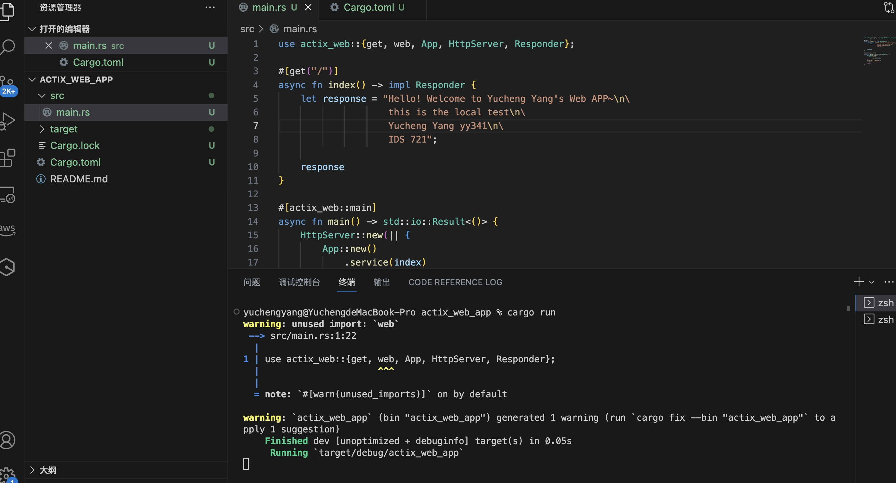
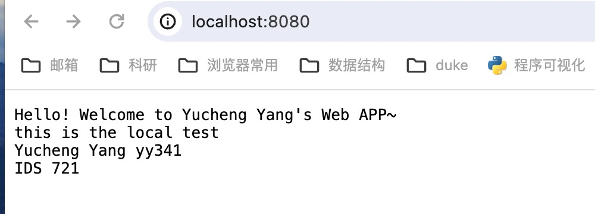
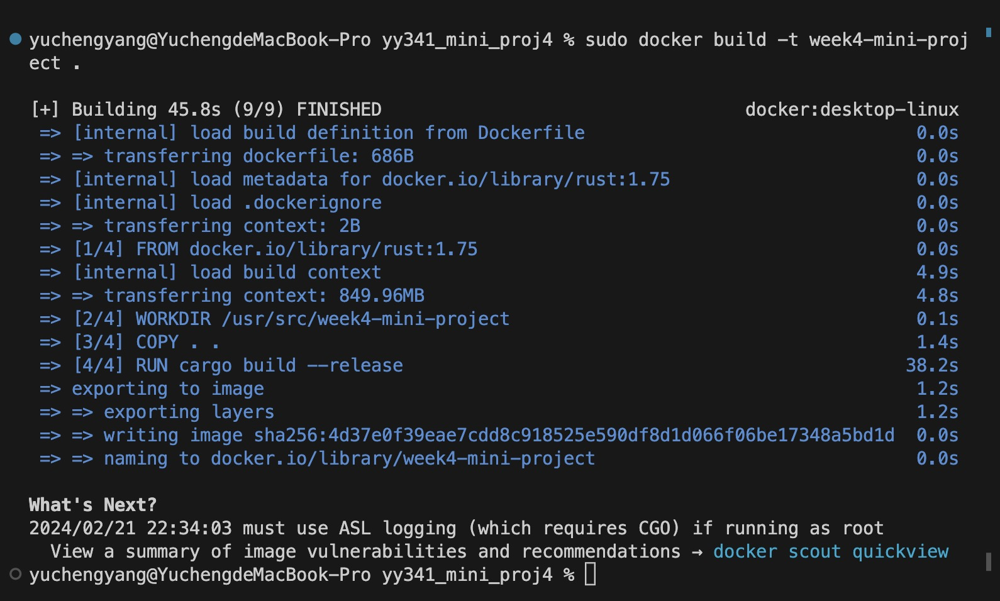
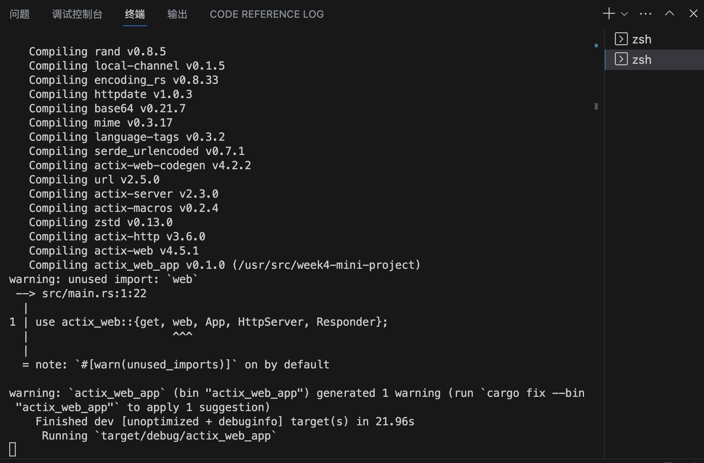
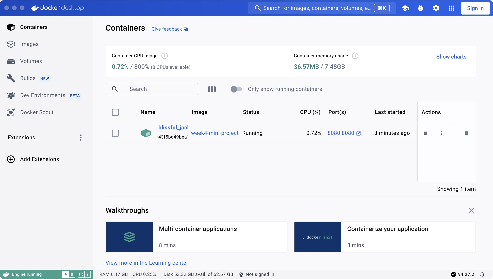
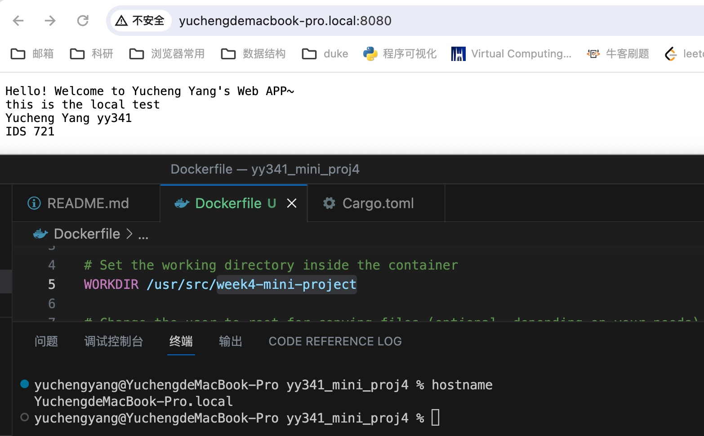

# IDS 721 Week 4 Mini Project

  

> Yucheng Yang (David)

> NetID: yy341

  

## Project Introduction


Containerize a Rust Actix Web Service

-   Requirements

-   Containerize simple Rust Actix web app
-   Build Docker image
-   Run container locally

## Project Description

This is a project that uses `Rust` to create a simple Arctix Web App. Typically, it requires to containerize simple Rust Actix web app, build a docker image, and run container locally. To run the container locally, it is required to download `Docker Desktop`.

  

## Project Setup

1. Create a template by
    
    ```
    cargo new actix_web_app
    ```
    
2.  Add needed dependencies to `Cargo.toml`. Here I added:
	```
	actix-web = "4.5.1"
	serde = { version = "1.0", features = ["derive"] }
	serde_json = "1.0"
	```
3.  Write content in the `src/main.rs`. Here my prints some words in the app/web page.
4.  Verify the application locally by `cargo run`. 
5.  Use Curl Command to test locally.
	```
	curl http://localhost:8080
	```
7.  Create a corresponding `Dockerfile`
8.  Make sure your `Docker Desktop` is open. Open a terminal, cd to your current directory, and run `cargo build` and `cargo run`. Open another terminal in the same time, run `sudo docker build -t <YOUR IMAGE NAME> .` You should be able to see your web app under `http://localhost:8080/` . Here I used `sudo docker build -t week4-mini-project .` 
9.  Run `docker run -d -p 8080:8080 <YOUR IMAGE NAME>` . Here I used `sudo docker run -d -p 8080:8080 week4-mini-project` .  Then open `Docker Desktop`, under your `Container` you should be able to open the `Port`. 

## Screenshots

### Run app locally



### Test the app


### Web app page



### Build the docker



### Run the Docker



### Containers in Docker Desktop



### Get hostname and web page

