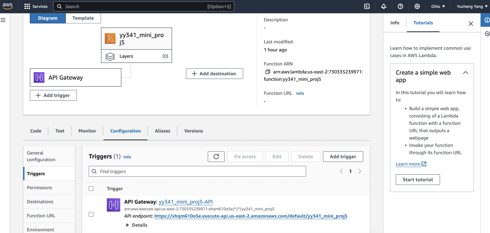
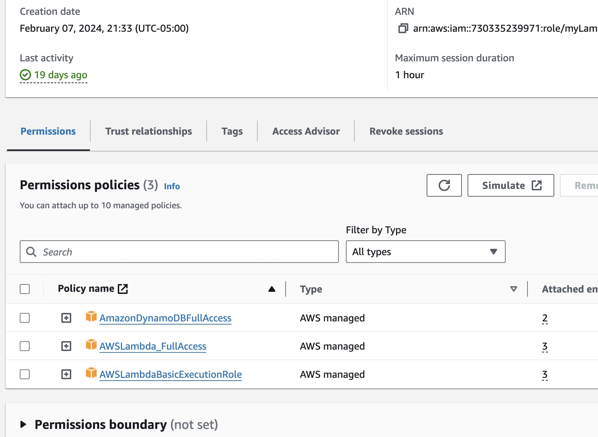
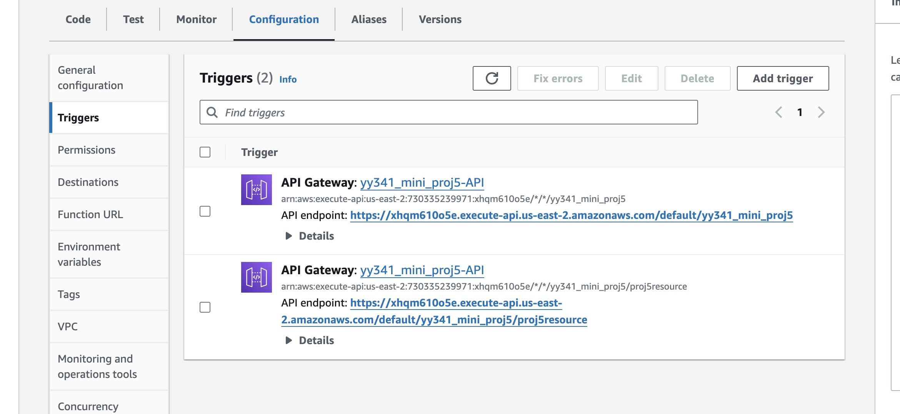
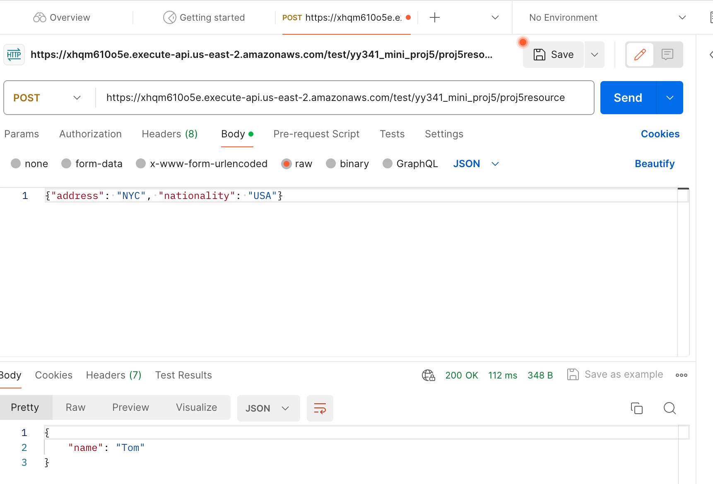
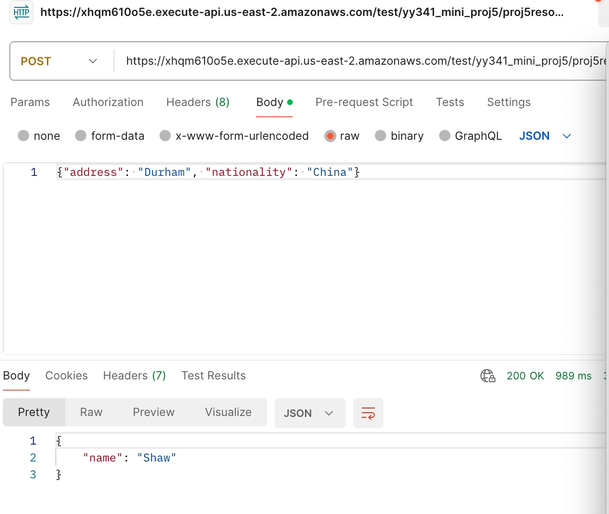
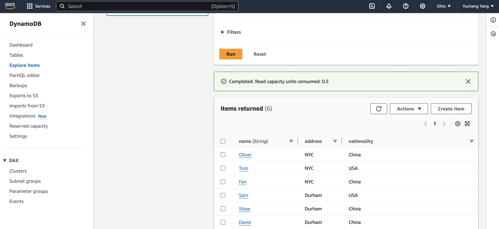

# IDS 721 Week 5 Mini Project

  

> Yucheng Yang (David)

> NetID: yy341

  

## Project Introduction


Serverless Rust Microservice

-   Requirements

-   Create a Rust AWS Lambda function (or app runner)
-   Implement a simple service
-   Connect to a database

## Project Description

This project centers around the development of a serverless microservice in Rust, utilizing AWS Lambda. The microservice is designed to provide a straightforward yet impactful functionality, seamlessly connecting with a database. Key elements encompass Rust Lambda capabilities, streamlined database integration, and the creation of a functional microservice. The project emphasizes comprehensive documentation for clarity, and its achievements will be showcased through screenshots, complemented by an in-depth narrative elucidating the service's architecture and functionality.

  

## Project Setup

1.  Initialize Rust Project

-   Begin by initializing your Cargo Lambda project using the command `cargo lambda new <YOUR-PROJECT-NAME>`.
-   Modify the `Cargo.toml` and `src/main.rs` file according to your design and requirements.
-   Navigate to the project directory, locally test the functionality by running the command `cargo lambda watch` .
    
2.  Edit files in the project template such as `main.rs` and `Cargo.toml`. In my case, the Rust AWS Lambda function is a simple service that fetches employee names from a DynamoDB database. Users can make requests with the employee's company and role parameters, and the function responds with the selected employee ID and name from the specified criteria. It demonstrates the use of Rust in serverless computing and is designed for straightforward integration with DynamoDB, making it an efficient and user-friendly microservice.
 
3.  Deploy the project to AWS. This is similar to what's done in mini project 2, so repetition is avoided here.

```
	cargo lambda build --release
	cargo lambda deploy --region us-east-2 --iam-role arn:aws:iam::730335239971:role/myLambda
```
4.  Attach the following policies to the role associated with the AWS Lambda function: `AmazonDynamoDBFullAccess`, `AWSLambda_FullAccess`, and `AWSLambdaBasicExecutionRole`.

5.  Search for **DynamoDB** on the AWS console. Create a new table named `EmployeeInfo`. Under **Explore items**, create some new items as data for the service. For example, here is one of my data entries in JSON:
```
{
  "name": {
    "S": "David"
  },
  "address": {
    "S": "Durham"
  },
  "nationality": {
    "S": "China"
  }
}
```
6.   Under the Lambda function, create a trigger, i.e., API gateway for the function. Create a REST API.
7.  Create a new resource for the REST API. Specify a resource name such as `week5-resource`. Then add an `ANY` method to the resouce.
8.  Deploy the API by clicking the button on the top right. Create a new stage called `test` for instance. Here is the official [guide](https://docs.aws.amazon.com/apigateway/latest/developerguide/how-to-deploy-api-with-console.html) from AWS.
9.  Then we can find the invoke URL under the newly created stage.
`https://xhqm610o5e.execute-api.us-east-2.amazonaws.com/test/yy341_mini_proj5/proj5resource` 

## Screenshots

### APP with API Gateway



### Permission Policies



### API Gateway Triggers



### Postman testing






### Database


