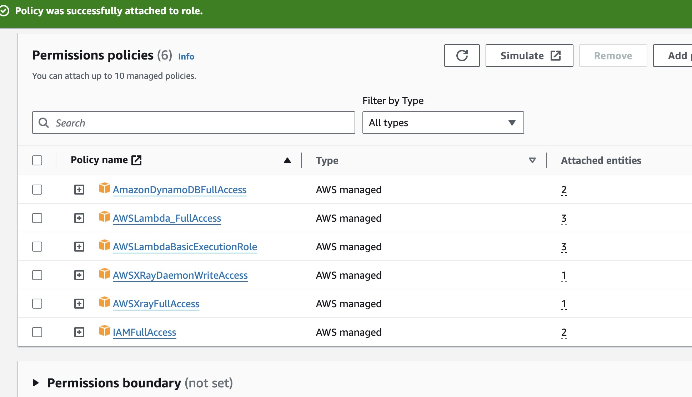
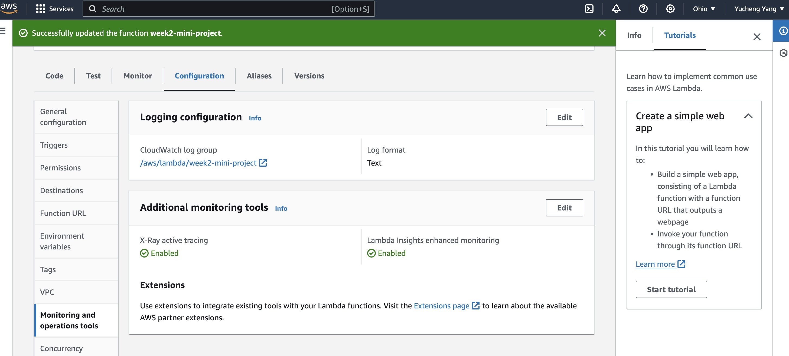
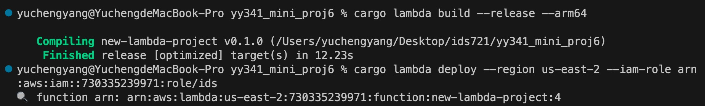
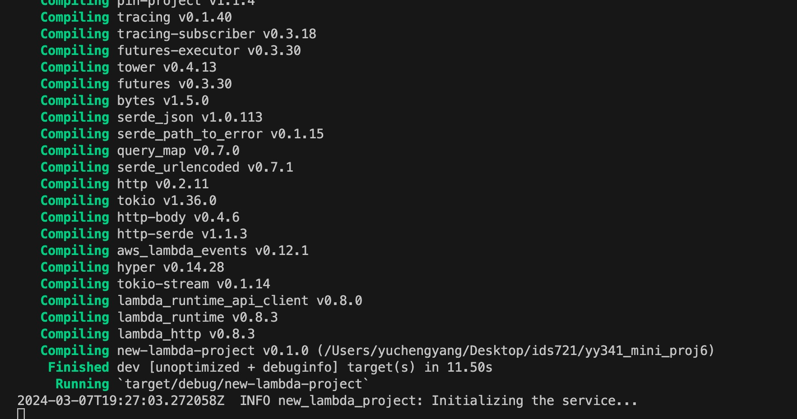
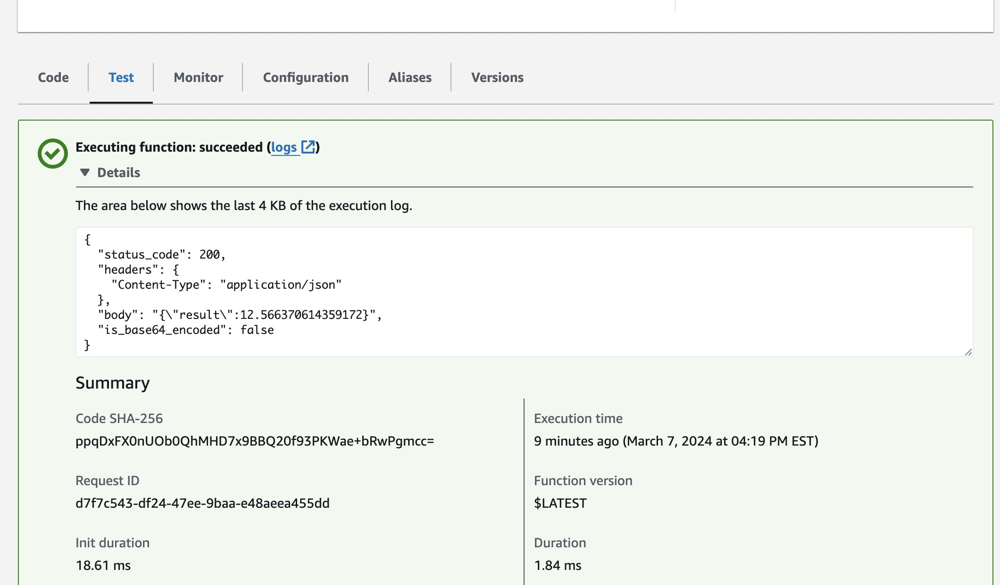
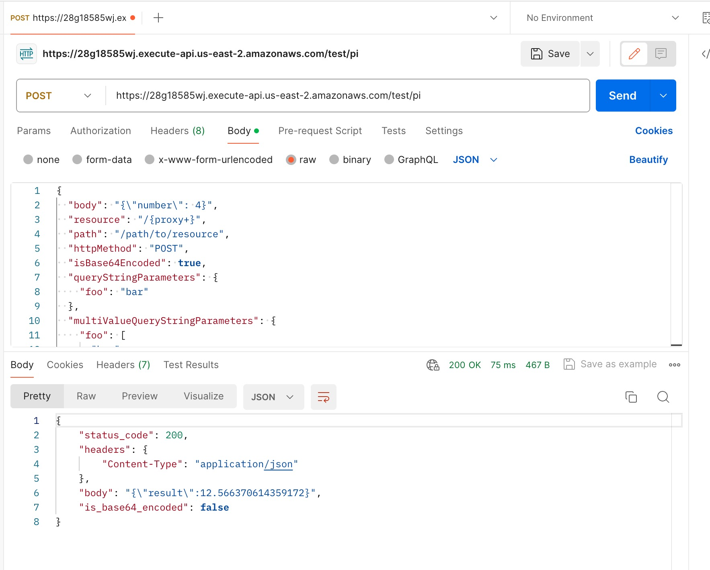
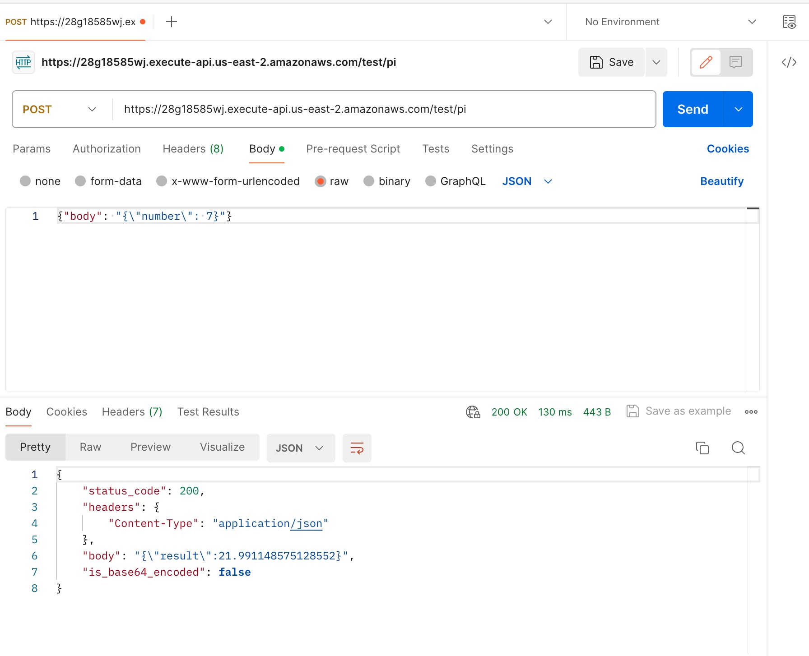
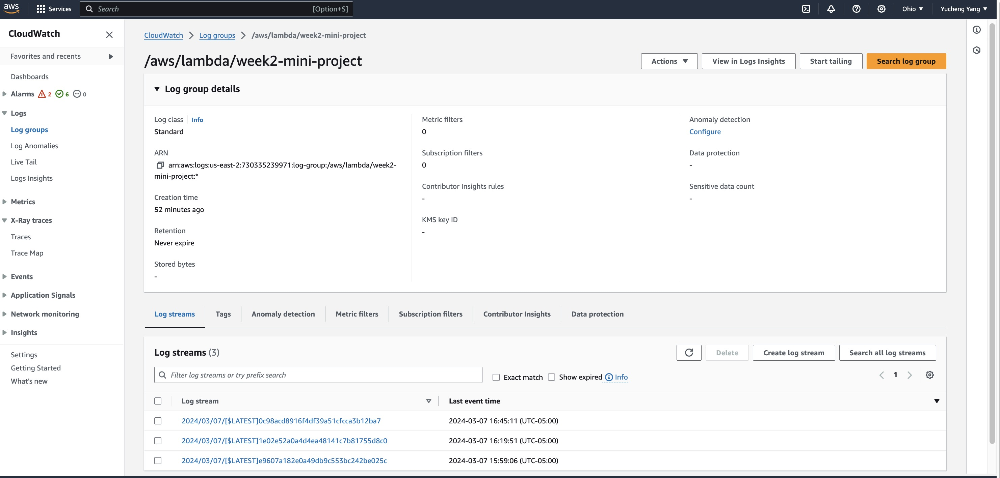
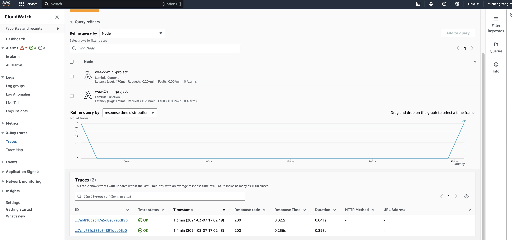
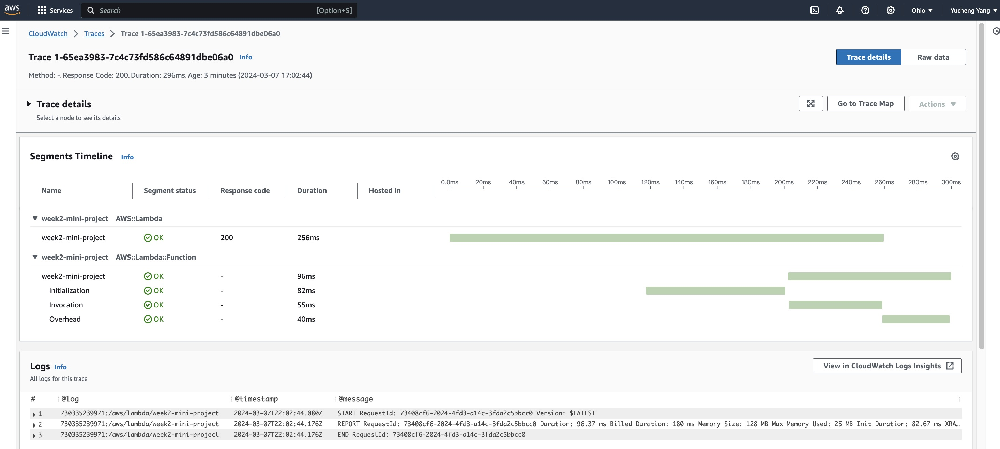

# IDS 721 Week 6 Mini Project

  

> Yucheng Yang (David)

> NetID: yy341

  

## Project Introduction

Instrument a Rust Lambda Function with Logging and Tracing

-   **Requirements**

-   Add logging to a Rust Lambda function
-   Integrate AWS X-Ray tracing
-   Connect logs/traces to CloudWatch

## Project Description

The objective of this Rust Lambda function project is to improve observability by implementing extensive logging using the tracing crate. Furthermore, AWS X-Ray tracing will be incorporated to offer detailed insights into the execution of the function. To centralize logs and traces, the application will seamlessly integrate with AWS CloudWatch, facilitating efficient monitoring, troubleshooting, and analysis of the Lambda function's performance within the AWS ecosystem.

  

## Logging Implementation


I repurposed the Lambda function utilized in the Week 2 Mini Project, which computes the $\pi$ times a specified number. Within Cargo.toml, I initially included the two prerequisites required for the logging implementation.

```toml
tracing = { version = "0.1", features = ["log"] }

tracing-subscriber = { version = "0.3", default-features = false, features = ["env-filter", "fmt"] }
```

Next, in main.rs, I incorporated the subsequent code to configure the logger:

```rust
// Set up the logger
let subscriber = FmtSubscriber::builder().with_max_level(Level::INFO).finish();

tracing::subscriber::set_global_default(subscriber).expect("Failed to set up global default logger");

info!("Initializing the service...");
```
Use `tracing::subscriber::set_global_default(subscriber)` to designate the configured log subscriber as the global default subscriber. This ensures that all subsequent tracing logs will employ this subscriber for processing.

The configuration and establishment of the global default tracing log subscriber empower the program to generate formatted log messages during runtime, showcasing messages of INFO level and above exclusively.

Subsequently, execute `cargo lambda build` and `cargo lambda deploy` to deploy the function to AWS Lambda. Furthermore, generate a new IAM role with the following six permissions: `IAMFullAccess`, `AWSXrayFullAccess`, `AWSXRayDaemonWriteAccess`, `AWSLambdaBasicExecutionRole`, `AWSLambda_FullAccess`, and `AmazonDynamoDBFullAccess`. This role grants the capability to read and write to DynamoDB, and facilitates X-Ray tracing for the function.

## X-Ray Tracing

Navigate to the AWS Management Console and ensure that the associated role has the required permissions.



Enable AWS X-Ray Active Tracing and Lambda Insights Enhanced Monitoring under the "Monitoring and Operations Tools" section.



## Testing


**Build Stage:**
```bash
cargo lambda build --release --arm64
```

**Deploy Stage:**
```bash
cargo lambda deploy --region us-east-2 --iam-role arn:aws:iam::730335239971:role/ids721
```



**Watch Stage:**
```bash
cargo lambda watch
```

These commands enable convenient execution of build, deploy, and watch stages. The Makefile encapsulates the complexity of the corresponding cargo lambda commands.

In the result, you can observe the logging messages being displayed.



**Lambda Function Test Stage:**




**Test Stage:**

Testing the deployed application can be done using either Postman in the terminal.

This command sends a POST request to the specified API endpoint with a JSON payload.

Output:





Make sure to provide the expected output or results obtained from the test for a more comprehensive understanding.

## CloudWatch Screenshots

Returning to the AWS Management Console, navigate to CloudWatch to inspect the traces and details associated with the Lambda function.

### APP with API Gateway





