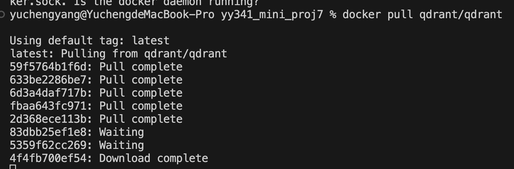
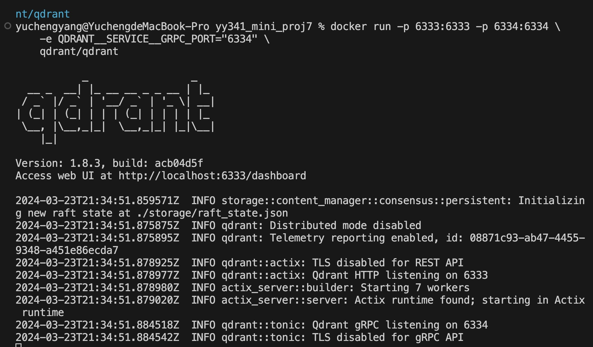
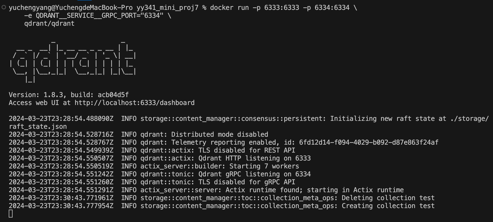
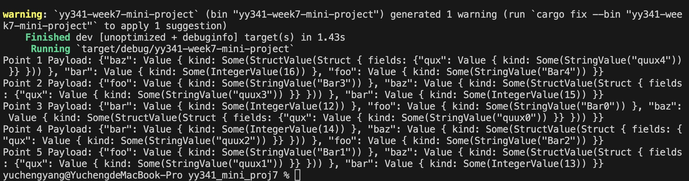

# IDS 721 Mini Project 7

  

> Yucheng Yang (David)

> NetID: yy341

  

## Project Introduction

Data Processing with Vector Database

-   Requirements

-   Ingest data into Vector database
-   Perform queries and aggregations
-   Visualize output

This project focuses on processing data using a vector database. Its primary objective involves ingesting data into the Vector database, executing queries and aggregations, and visualizing the resulting output.

## Project Steps

### Project Setup:

1. Begin by creating a new Rust project:
```rust
cargo new yc557-week7-mini-project
```

2. Add the necessary dependencies to the Cargo.toml file:
```toml
[dependencies]
qdrant-client = "1.8.0"
tokio = { version = "1.36.0", features = ["rt-multi-thread"] }
serde_json = "1.0.114"
tonic = "0.11.0"
anyhow = "1.0.81"
```

For the vector database, the plan is to utilize Qdrant, following the official documentation.

To set up Qdrant:

1. Download the latest Qdrant image from Dockerhub:
```bash
docker pull qdrant/qdrant
```

2. Then, run the service:
```bash
docker run -p 6333:6333 -p 6334:6334 \
    -e QDRANT__SERVICE__GRPC_PORT="6334" \
    qdrant/qdrant
```

### Data Ingestion
To ingest data into the database, loop five times to create and ingest five different data points into the collection. Each point should have a vector (`vec![12.0 + i as f32; 10]`), where `i` varies in each iteration to slightly alter the vector values. Additionally, include a payload that contains structured data (`foo`, `bar`, `baz.qux`), which also varies in each iteration.

```
async fn ingest_points(client: &QdrantClient, collection_name: &str) -> Result<()> {
for i in 0..5 {
let payload: Payload = json!({
"foo": format!("Bar{}", i),
"bar": 12 + i,
"baz": {"qux": format!("quux{}", i)}
}).try_into().map_err(|e| anyhow!("Payload conversion error: {:?}", e))?;
let points = vec![PointStruct::new(i, vec![12.0 + i as f32; 10], payload)];
client.upsert_points_blocking(collection_name, None, points, None).await?;
}
Ok(())
}
```

### Performing Queries

Perform a query against the collection to find points that are similar to a query vector (`vec![11.; 10]`). The query should not apply any filters (`filter: None`), request up to 5 points (`limit: 5`), and include payload data in the results (`with_payload: Some(true.into())`).

```
async fn visualize_output(client: &QdrantClient, collection_name: &str) -> Result<()> {
let search_result = client.search_points(&SearchPoints {
collection_name: collection_name.into(),
vector: vec![11.; 10],
filter: None,
limit: 5,
with_payload: Some(true.into()),
..default::default()
}).await?;

```

### Visualizing the Output

Iterate over the results of the query, printing out the payload of each found point.

```
for (index, point) in search_result.result.iter().enumerate() {
println!("Point {} Payload: {:?}", index + 1, point.payload);
}
Ok(())
}
```

## Screenshots
Download the latest Qdrant image from Dockerhub:


Connect to Qdrant vector database:


Run the service:


Visualize the output:



