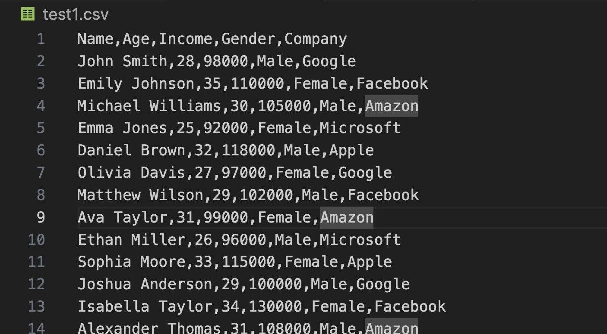
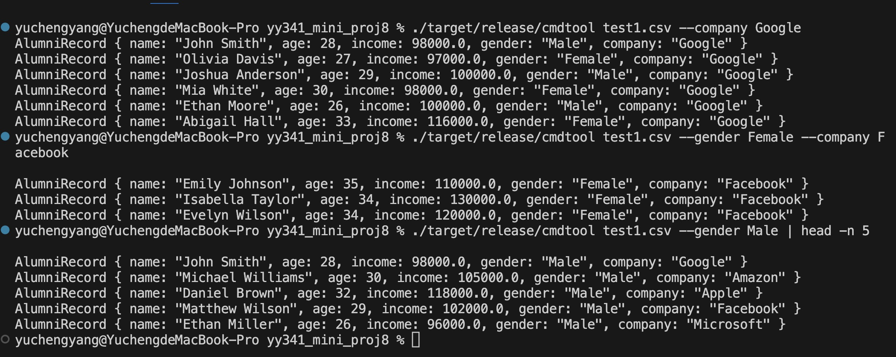
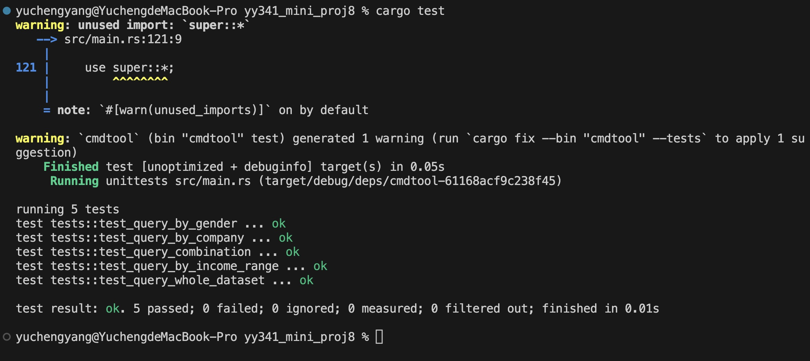

# IDS 721 Mini Project 8

  

> Yucheng Yang (David)

> NetID: yy341

  

## Project Introduction

The purpose of this project is to develop a command-line tool for handling CSV files. This tool allows users to specify the input CSV file, filter records based on the income and company of alumni, and print the filtered records to the console. The main objective of this tool is to provide users with a convenient way to extract records from CSV files based on specific criteria, such as income and company, to facilitate data analysis and processing tasks.

## Project Setup

1. Install Rust: Ensure Rust is installed on your system.

2. Create a New Project: Use Cargo, Rust's package manager, to create a new project. Run the following command in your terminal:

```
cargo new cmdtool
```

3. Add Dependencies: Add the necessary dependencies to your Cargo.toml file. Include dependencies such as clap for command-line argument parsing and csv for CSV file handling. Your Cargo.toml might look like this:

```
[dependencies]
serde_json = "1.0.113"
serde = { version = "1.0.196", features = ["derive"] }
csv = "1.1.6"
clap = "2.27.1"
tokio = { version = "1.37.0", features = ["rt", "rt-multi-thread", "macros"] }
```

## Tool Functionality

The code defines a command-line tool for processing CSV files. It utilizes the clap crate to parse command-line arguments, allowing users to specify the input CSV file, filter records based on the income and company of alumni, and print the filtered records to the console.

The process_csv function reads the CSV file specified by the user and parses its contents into AlumniRecord structs. It uses the csv crate to handle CSV parsing. Each CSV record is converted into a AlumniRecord, containing fields such as name, age, income, gender, and company.

**Data for Testing**



The filter_records function takes the parsed AlumniRecord vector, along with the gender, company, and income range criteria, and filters the records based on these criteria. It returns a vector containing only the records that match the specified criteria.

Based on the provided code, the command-line format should be as follows:

```
./target/release/cmdtool <file> [OPTIONS]
```

Where:

- `<file>` represents the path to the input CSV file to be processed.
- `[OPTIONS]` represents optional command-line options that users can optionally use to filter the query results.

Available options include:

- `--gender <gender>` or `-g <gender>`: Filter by gender. `<gender>` should be the gender value to filter by.
- `--company <company>` or `-c <company>`: Filter by company. `<company>` should be the company name to filter by.
- `--low <income>` or `-l <income>`: Set the lower bound of the income range. `<income>` should be the lower bound value of the income range.
- `--high <income>` or `-h <income>`: Set the upper bound of the income range. `<income>` should be the upper bound value of the income range.

For example, to query alumni data from the specified CSV file, you can use the following command format:

```
./target/release/cmdtool test1.csv --gender Female --company Facebook --low 90000 --high 120000
```

This command will query alumni data from the `test1.csv` file that meets the following criteria:

- Gender is Female.
- Company is Facebook.
- Income is between 90000 and 120000.

**Sample Outputs**



## Testing Report

**Test Case 1: Query Whole Dataset**

**Description:** This test case verifies whether the command-line tool retrieves the entire dataset from the CSV file correctly.

**Test Procedure:**
1. Execute the command-line tool with the input CSV file as the argument.
2. Capture the output of the command-line tool.
3. Check if the output contains specific names, such as "John Smith" and "Sophia Moore".

**Expected Result:** The output should contain all records from the CSV file, including "John Smith" and "Sophia Moore".

**Test Case 2: Query by Gender**

**Description:** This test case checks if the command-line tool filters records based on the specified gender correctly.

**Test Procedure:**
1. Execute the command-line tool with the input CSV file and the gender argument set to "Male".
2. Capture the output of the command-line tool.
3. Verify that the output contains records of male individuals, such as "John Smith" but not "Emily Johnson".

**Expected Result:** The output should contain records of male individuals, such as "John Smith", while excluding records of female individuals like "Emily Johnson".

**Test Case 3: Query by Company**

**Description:** This test case ensures that the command-line tool filters records based on the specified company accurately.

**Test Procedure:**
1. Execute the command-line tool with the input CSV file and the company argument set to "Google".
2. Capture the output of the command-line tool.
3. Confirm that the output contains records associated with the company "Google", including "John Smith" and "Olivia Davis".

**Expected Result:** The output should include records associated with the company "Google", such as "John Smith" and "Olivia Davis".

**Test Case 4: Query by Income Range**

**Description:** This test case verifies whether the command-line tool filters records within the specified income range correctly.

**Test Procedure:**
1. Execute the command-line tool with the input CSV file and income range arguments set to a range between 90000 and 120000.
2. Capture the output of the command-line tool.
3. Ensure that the output contains records with incomes within the specified range, such as "John Smith" and "Sophia Moore", but not "Isabella Taylor".

**Expected Result:** The output should contain records with incomes falling within the specified range, excluding individuals with incomes outside the range, such as "Isabella Taylor".

**Test Case 5: Query Combination**

**Description:** This test case examines if the command-line tool correctly handles a combination of multiple query parameters.

**Test Procedure:**
1. Execute the command-line tool with the input CSV file and multiple query parameters, including gender "Male", company "Facebook", and a low income of 100000.
2. Capture the output of the command-line tool.
3. Check that the output contains records meeting all specified criteria, such as "Matthew Wilson", but not "John Smith".

**Expected Result:** The output should include records satisfying all specified criteria, such as "Matthew Wilson", while excluding records that do not meet the criteria, such as "John Smith".

**Implementation**

```rust
#[cfg(test)]
mod tests {
    use super::*;
    use std::process::Command;

    #[test]
    fn test_query_whole_dataset() {
        let output = Command::new("./target/release/cmdtool")
            .arg("test1.csv")
            .output()
            .expect("failed to execute process");
        
        let stdout = String::from_utf8_lossy(&output.stdout);
        assert!(stdout.contains("John Smith") && stdout.contains("Sophia Moore"));
    }

    #[test]
    fn test_query_by_gender() {
        let output = Command::new("./target/release/cmdtool")
            .args(&["test1.csv", "--gender", "Male"])
            .output()
            .expect("failed to execute process");
        
        let stdout = String::from_utf8_lossy(&output.stdout);
        assert!(stdout.contains("John Smith") && !stdout.contains("Emily Johnson"));
    }

    #[test]
    fn test_query_by_company() {
        let output = Command::new("./target/release/cmdtool")
            .args(&["test1.csv", "--company", "Google"])
            .output()
            .expect("failed to execute process");
        
        let stdout = String::from_utf8_lossy(&output.stdout);
        assert!(stdout.contains("John Smith") && stdout.contains("Olivia Davis"));
    }

    #[test]
    fn test_query_by_income_range() {
        let output = Command::new("./target/release/cmdtool")
            .args(&["test1.csv", "--low", "90000", "--high", "120000"])
            .output()
            .expect("failed to execute process");
        
        let stdout = String::from_utf8_lossy(&output.stdout);
        assert!(stdout.contains("John Smith") && stdout.contains("Sophia Moore") && !stdout.contains("Isabella Taylor"));
    }

    #[test]
    fn test_query_combination() {
        let output = Command::new("./target/release/cmdtool")
            .args(&["test1.csv", "--gender", "Male", "--company", "Facebook", "--low", "100000"])
            .output()
            .expect("failed to execute process");
        
        let stdout = String::from_utf8_lossy(&output.stdout);
        assert!(stdout.contains("Matthew Wilson") && !stdout.contains("John Smith"));
    }
}
```

This test ensures that the filtering functionality behaves as expected and can be used to validate the correctness of the tool's processing logic.

**Pass Testing**



## Project Conclusion

The command-line tool developed in this project provides users with a flexible and efficient way to process CSV files, allowing them to extract records based on specific criteria such as income and company. By offering a command-line interface and corresponding data processing functionality, this tool serves as a valuable asset for data analysis and processing tasks.


