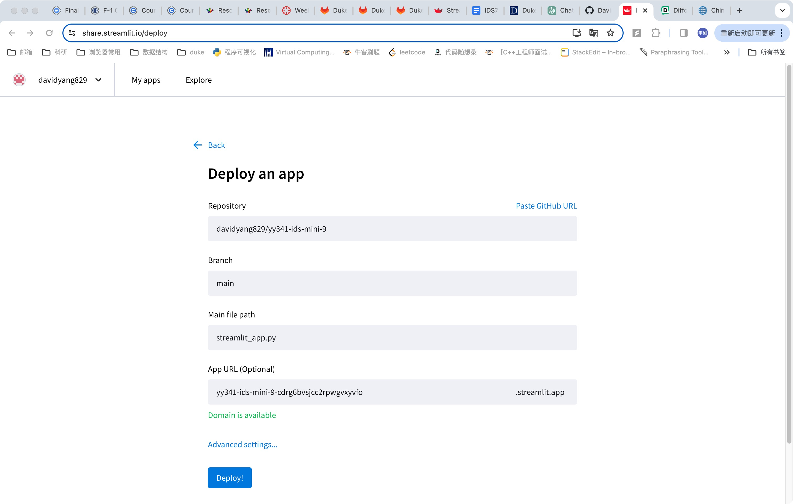
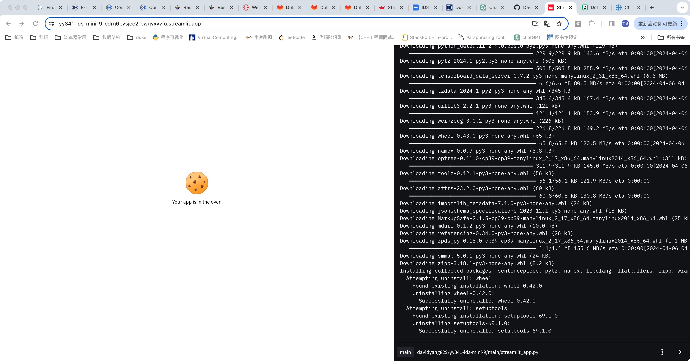
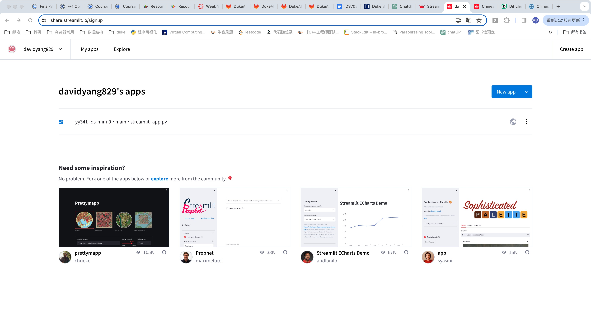
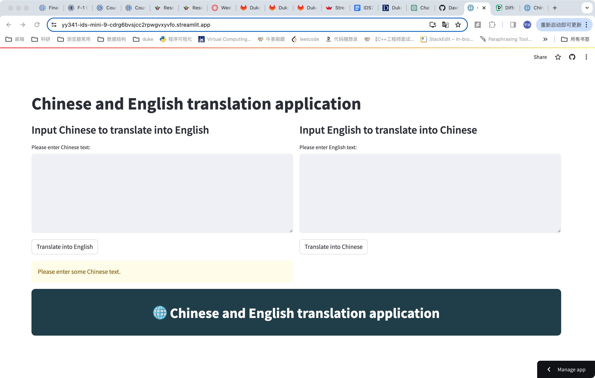
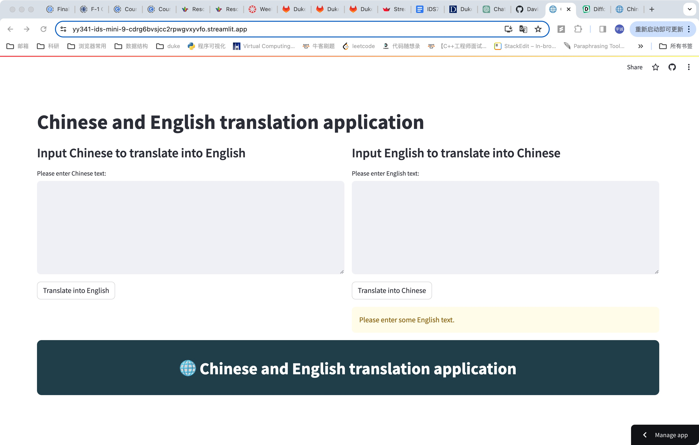
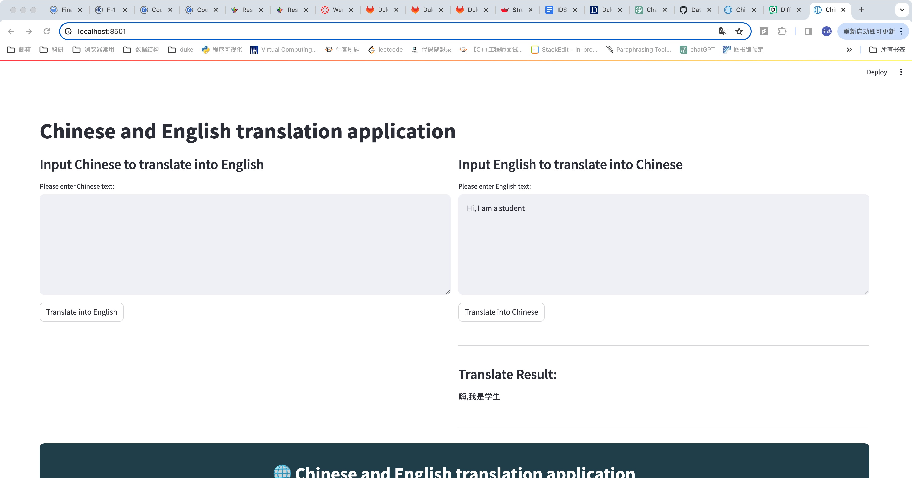
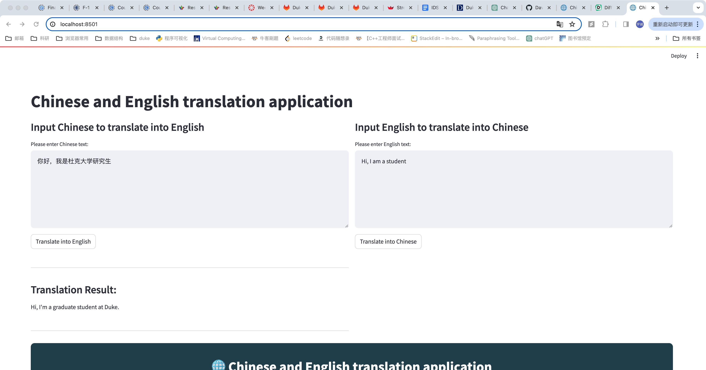

# IDS 721 Mini Project 9

  

> Yucheng Yang (David)

> NetID: yy341


  

## Project Introduction

This project aims to develop a web application using Streamlit, integrate it with an open-source Language Model (LLM) from Hugging Face, and deploy the model via Streamlit for accessibility through a web browser.


## Project Setup
1. **Streamlit Setup**:

-   Create an empty Git repository for the project.
-   Set up a Python development environment.
-   Install Streamlit by running `pip3 install streamlit`.

2.  **Create a `requirements.txt` file**: You need to create a `requirements.txt` file that lists the dependencies of your app. You can generate this file using `pip freeze`:
    
    ```
    pip freeze > requirements.txt
    ```

3.**Create a `setup.sh` file**: Streamlit requires a `setup.sh` file to tell it how to run your app. Create a file named `setup.sh` with the following content:

```
mkdir -p ~/.streamlit/
echo "\
[server]\n\
headless = true\n\
port = $PORT\n\
enableCORS = false\n\
\n\
" > ~/.streamlit/config.toml
```

4. **Implementation of Streamlit Web Application**: 
The detailed implementation is available in the `streamlit_app.py` file.

5. **Testing Locally**:

-   Test the application locally by running `streamlit run streamlit_app.py`.
-   Access the web application at the local URL: [http://localhost:8501](http://localhost:8501/).

6. **Project Deployment on Streamlit**:

-   Create an account and sign in to [https://streamlit.io/](https://streamlit.io/).
-   Under [https://share.streamlit.io/](https://share.streamlit.io/), create a new app using the existing repository.
- 


-   Ensure the correctness of the repository, branch, and application file.




-   Deploy the application and access the logs during the deployment process.



-   Upon successful deployment, the Streamlit application can be accessed using the provided URL: [https://yy341-ids-mini-9-k8i7ekwwd2huxaprfu8xbv.streamlit.app/](https://yy341-ids-mini-9-k8i7ekwwd2huxaprfu8xbv.streamlit.app/).

Sometimes it may causes some timeout problems and rebooting can always handle with that.

## Web Function Screenshots

**Functionality**:
The Streamlit App facilitates the translation of sentences from Chinese into English and English to Chinese by leveraging an open-source Language Model (LLM) from the transformers library. Users can input Chinese/English sentences into the provided text area. Upon clicking the "translate" button, the application utilizes the LLM to translate the input text into English/Chinese. The translated content is then displayed beneath the text window for user reference and validation.

An example has been provided within the application for testing purposes, allowing users to experience the translation functionality seamlessly.











